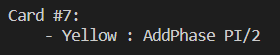

# Quantum UNO


A console version of UNO which demonstrates four core ideas of quantum computing:
superposition, entanglement, interference, and measurement.

The quantum computing elements of this game are simulated with Qiskit's Aer Simulator.

The details of these ideas and their implementation are in the project report.

## How to Play

Run the game by first pip installing qiskit, then
type the following command:

```
python -m quno.py
```

The game runs the same as normal UNO, but it replaces the special cards with a few new quantum-related features.

## Play Screen

This is what you see as you play the game.


Due to the limitations of this being a console game, each central component is listed out in sections shown above.

After playing a card or drawing from the deck, you will be prompted to bring the next player to the screen to continue playing.

## Superposition Cards

One of the interesting cards in the game are superposition cards. An example is shown below.


In this example, the card is both a "Green 3" card and a "Blue 4" card. You can play this card whenever the top card in the "USED PILE" is Green, Blue, a 3, or a 4.

Once you place this card, a quantum circuit is created and measures a superposition representation of this card in the simulator. It will have a 50% chance of being a "Green 3" or a "Blue 4".

## Make Entangled and Entangled Cards

Another interesting card is the "Make Entangled" card.


In this example, this card can only be placed when the top card in the "USED PILE" is green.

When this card is played, two new cards are created: a Red and a Yellow (number is random). There is a 50% chance that the Red or the Yellow card is placed on top of the "USED PILE". The other card is then placed in the next player's hand as a "Entangled Card".

"Entangled" cards are different from "Make Entangled" cards. "Entangled" cards requires the player who holds them to waste a turn to "measure" it.

Suppose that we have two players, ```Player A``` and ```Player B```. ```Player A``` just played the "Make Entangled" card above and the Red card was placed in the "USED PILE".

```Player B``` will then see a new card in their hand:


```Player A``` will know that ```Player B``` will have a Yellow card in their hand, but ```Player B``` must waste a turn to discover what they actually have.

## Add Phase Cards

"Add Phase" cards influence the next card that will be pulled from the Deck.



Unlike normal UNO, the colors of the top card of the deck is always shown.


Each "Add Phase" card shifts the color of the top card based on the scheme below.

- Green
    - Green or Yellow
- Yellow
    - Yellow or Blue
- Blue
    - Blue or Red
- Red
    - Red or Green

In the example above, the next card will be Green. If a player plays a "Add Phase" card, it will shift to a superposition of Green and Yellow.


Once a player pulls from the deck, it will become either a Green card or a Yellow card, 50/50.
